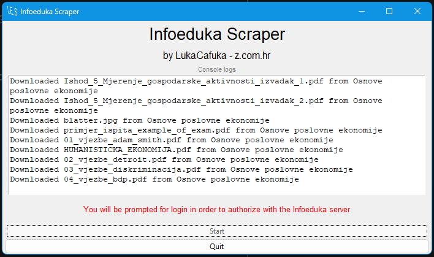

# Infoeduka Scraper
### ATTENTION: This software was made exclusively for students of Algebra University College
###### if you are not a student at Algebra there is no use for you in this software

### **This scraper scrapes study materials from Algebra's college web portal (student.algebra.hr), better known as Infoeduka**  
This program comes in two variations: **GUI and CLI**, if you aren't experienced with the terminal it's recommended to use the GUI version.
As seen from the image above.

## How to install
The GUI version is recommended for inexperienced users
1. Get the GUI .exe from the releases page on the Github repo or from the bin directory in the repo
2. Run the executable and click the 'Start' the button  
The CLI version follows the same install principle  
**You can also just directly run the .py files themselves, but note that you need to install dependencies included in the `requirements.txt` file by running `pip install -r requirements.txt`**

## How it works
When the program is run via the 'Start' button on the GUI or via terminal execution, it first asks the user the file path of where the scraped data will be saved. The program automatically creates a subdirectory called 'InfoedukaScraper' and then prompts the user for authentication.
#### Why do you need my login credentials?
There is an API URL on Infoeduka that sends the user a big JSON file containing all of their info for their study materials, including their year, semester, ECTS points, subjects, categories of subjects, materials, **filenames of materials**, **URL links to the materials**, and so on... Basically there is a whole JSON file that gets sent over the following URL: `https://student.algebra.hr/digitalnareferada/api/student/predmeti/?dodatno=materijali`  
There is a problem, however, in order to access the JSON data, authentication is required, otherwise you will get an HTTP 401 error. This means that the scraper needs some form of authentication data, like a cookie (which it does use in order to authenticate), in order to fetch the appropriate links and to also fetch the files themselves. When the user has been authorized the cookie is then passed on to the HTTP request and the JSON fetch can be made, which in turn, gives the program knowledge of the links for all of the study materials. Now that the program has the links, it will start downloading the files one by one (hope to implement parallel downloading soon...) and log them to the console for info. Once the download has finished, the app can be closed, and you're done!

## CLI Usage
You can run the program in a CLI like this: `python infoedukascrape.py --path "C:\Path\To\File\Outputs"`   or via the executable `.\infoedukascrape-cli.exe --path "C:\Path\To\File\Outputs"`  
- Use: `-h` or `--help` to print out information about the program  
- Use: `-p` or `--path` followed by the path to the download directory, to specify the download directory. **This is mandatory**  
- Use: `-c` or `--cookie` followed by your authentication cookie to manually specify your cookie instead of a web prompt. You should pass it like this `--cookie "6hdoaedhhbgc57lld1cpd0ifq7"`    
If the `-c` or `--cookie` was not specified the program will prompt the user for the login in a browser  
- Use: `-s` or `--show-cookie` to print your cookie in the console before the download begins, this is hidden by default  

## CLI Examples
`.\infoedukascrape-cli.exe -p "C:\Users\myuser\Downloads\"`  
`.\infoedukascrape-cli.exe --path "C:\Users\myuser\Downloads\" --cookie "6hdoaedhhbgc57lld1cpd0ifq7" --show-cookie`

## Future ideas
- Implement parallel downloading
- Add option to specify which collage subject to download
- Make GUI more usable
- Scrape more than just collage materials
- Add Dockerfile
- Implement automatic cronjob execution
- Skipping files if already downloaded